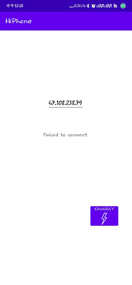
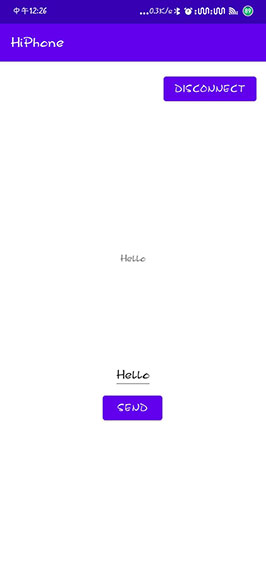

# Hiphone

## Introduction

一个简陋，四不像的套接字通信应用，包含一个Android应用（客户端）和windows桌面应用（服务器），实现客户端IP连接服务器，并且可以互发消息

## 客户端（Android）

包含两个Acitvity（登录界面，通信界面）

## 服务端（控制台应用程序）

- C++语言编写
- 监听连接，多线程输入、发送指令消息

## 服务器指令

- call [number] 打电话
- say [content] 发送消息（不是短信）

## 客户端指令

客户端发送的任何指令都会在服务器上当作cmd命令执行